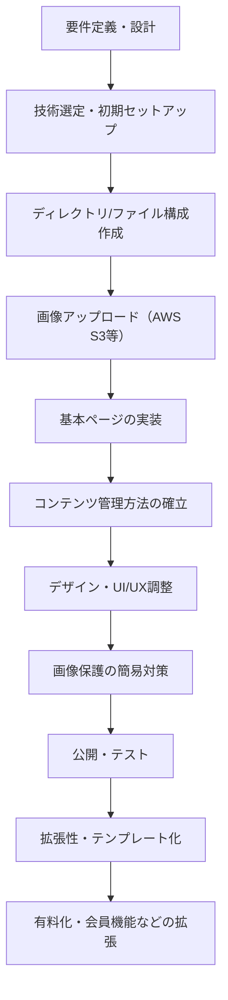

# 制作フロー

## 全体フローチャート

---

## 各フェーズの詳細

### フェーズ 1：最小構成の静的サイト構築（無料運用）

1. 要件定義・設計
2. 技術選定・初期セットアップ
3. ディレクトリ/ファイル構成作成
4. 画像ファイルの AWS S3 等へのアップロード
5. メタデータに画像 URL を記載
6. 基本ページの実装（トップ・一覧・各話・ギャラリー・日記）
7. コンテンツ管理方法の確立
8. デザイン・UI/UX 調整
9. 画像保護の簡易対策
10. 公開・テスト

---

### フェーズ 2：拡張性・テンプレート化の準備

1. サイト構成のテンプレート化
2. しおり機能の強化
3. SNS 連携・シェアボタンの追加

---

### フェーズ 3：有料化・会員機能などの拡張

1. 会員登録・ログイン機能（バックエンド導入）
2. 有料コンテンツ管理
3. 画像保護の強化
4. 通知機能・メール配信

---

## 備考

- 各フェーズは順次進行し、必要に応じて戻ることも可能です。
- 詳細なタスクや進捗は`CHECKLIST.md`で管理します。
