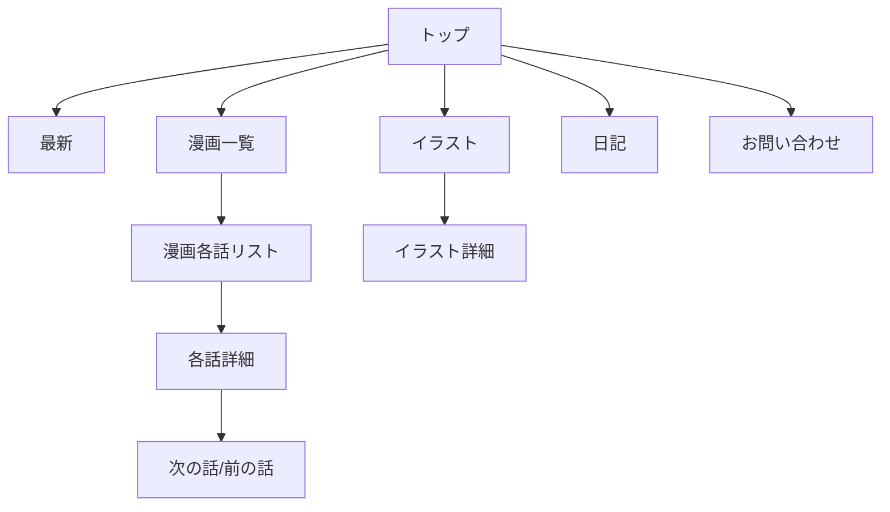

# サイト設計・ワイヤーフレーム

## サイトマップ

- トップ
  - 最新
  - 漫画一覧
    - 各話ページ
  - イラスト
  - 日記
  - お問い合わせ

## 画面遷移図

- 漫画一覧 → 漫画各話リスト → 各話詳細 → 次の話/前の話
- イラスト → イラスト詳細
- トップから各主要ページへ遷移

## ワイヤーフレーム

[ロゴ][ナビゲーション（漫画一覧｜イラスト｜日記｜お問い合わせ）]

┌─────────────────────────────┐
│ 新着漫画（サムネイル＋タイトル＋話数） │
│ [漫画 A][1話] [漫画 B][5話] [漫画 C][3話] ... │
├─────────────────────────────┤
│ 作品一覧（漫画メインのリストやグリッド） │
│ [漫画 A] [漫画 B] [漫画 C] ... │
└─────────────────────────────┘

[フッター][広告スペース（サイドや下部）]

## デザインイメージ

- シンプル・読みやすさ重視

  - 余白をしっかり取り、文字やボタンは最小限
  - ページ送りやしおり機能は直感的な UI に
  - ダークモード対応も検討（目の負担軽減）

- レスポンシブ対応

  - スマホでは片面表示、PC では見開き表示
  - ナビゲーションはハンバーガーメニューや下部固定バーも検討

- 広告スペースの配置案

  - サイドバーやフッター、話と話の間など「漫画閲覧の邪魔にならない場所」に限定
  - 有料版では広告非表示も選択肢

- 有料化・マネタイズのアイデア

  - 最新話は有料会員限定 or 広告視聴でアンロック（一定期間後に無料開放も可）
  - 有料会員特典：広告非表示、最新話・限定話の先行公開、おまけイラスト閲覧など
  - 投げ銭・サポートボタンも検討

- 集中サポート（任意機能）
  - 「○ 話読んだら休憩しませんか？」などの軽い通知はオプションで ON/OFF できると親切
